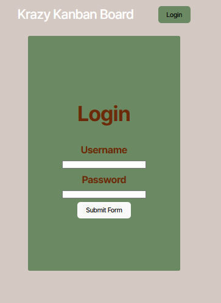
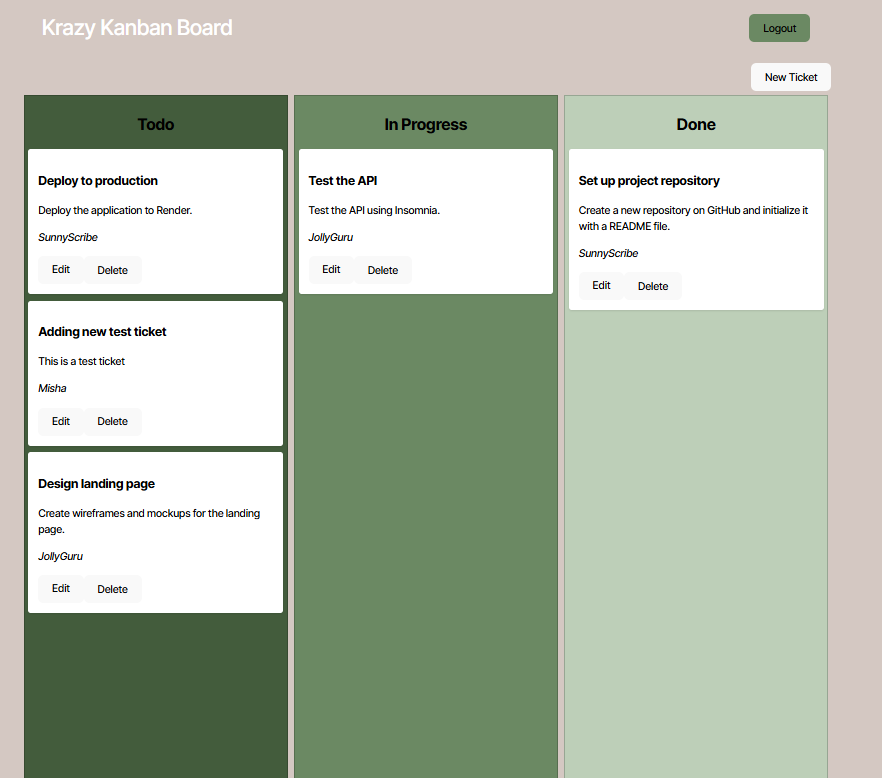

# Krazy Kanban Board

## Description
It is a Kanban board which can be accessed and edited by logging in. Accounts logged in are authenticated use JWT tokens.

## Table Of Contents
1. [Installation](#installation)
2. [Usage](#usage)
3. [License](#license)
4. [Contribution Guidelines](#contribution)
5. [Tests](#tests)
6. [Questions](#questions)

## Installation
Install the files to your machine, open the outermost file in a terminal and run "npm install" to install the necessary dependencies. You will also need to initialize the SQL database located in the server/db folder.

## Usage
Start the program using "npm start", then log in using one of the premade user accounts. You can also post a new user account to the application if you prefer. Once logged in, you can access and update the Kanban board as necessary. And when you are done you can log out by clicking the Logout button.

You will be prompted to log in through the window above.  

Once logged in, you will be presented with the above Kanban Board.

## License
Distributed under the MIT. Visit [MIT](https://opensource.org/licenses/MIT) for more information.

## Contribution Guidelines
None

## Tests
Visual Studio code and Render

## Questions
Feel free to reach out to me if you have any questions, or if you'd like to find out what else I've worked on. My details are as follows:  
  Github: https://github.com/Liathor  
  Email: dyermisha@gmail.com  
